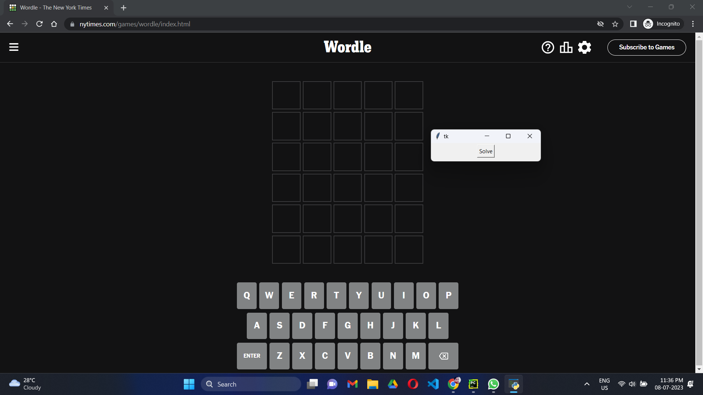
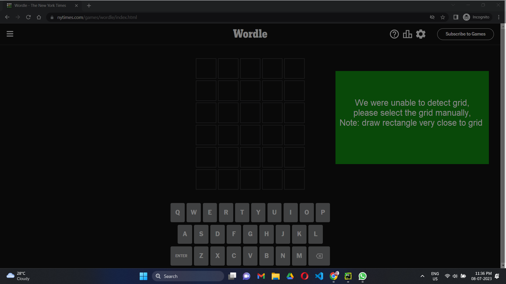
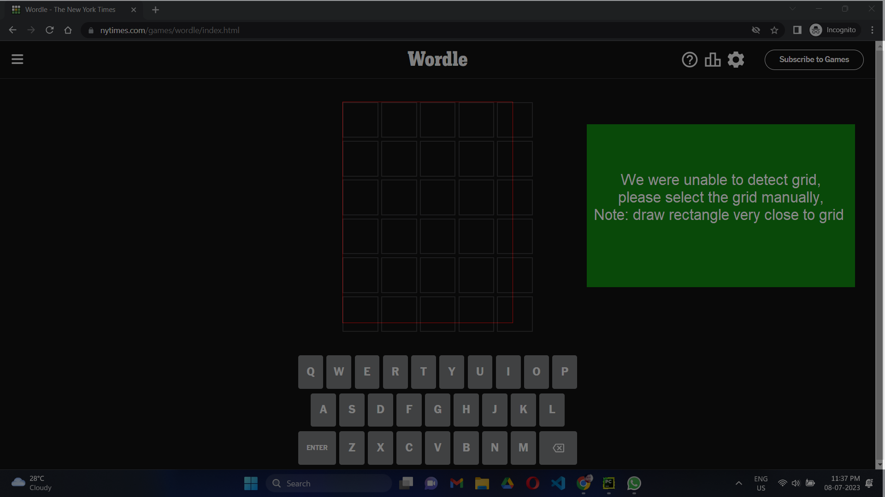
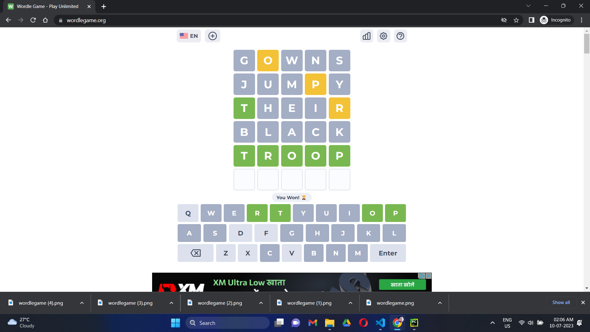
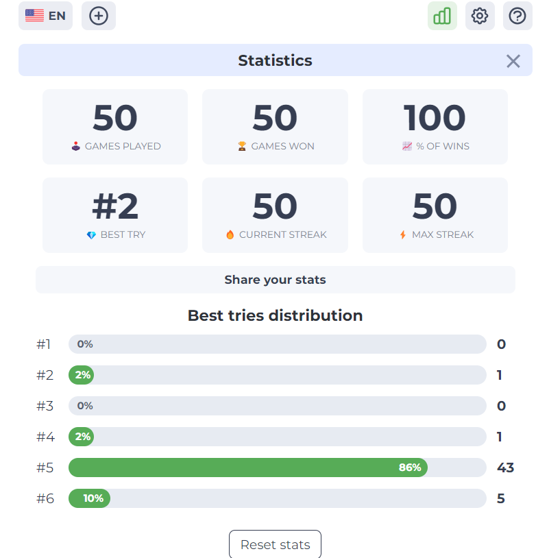

To play NYT Wordle (supporting light/dark theme):
- python -m venv venv
- venv/Scripts/activate or source venv/bin/activate
- pip install requirements.txt
- python playwordle.py

To understand appraoch of this solver read Wordle_Solver.pdf
- 
Click Solve button to Start
- 
If Failed to Auto Detection of Grid
- 
Selection of grid
- 
Completed Solving
- 

Stats of 50% games played by Wordle Solver
